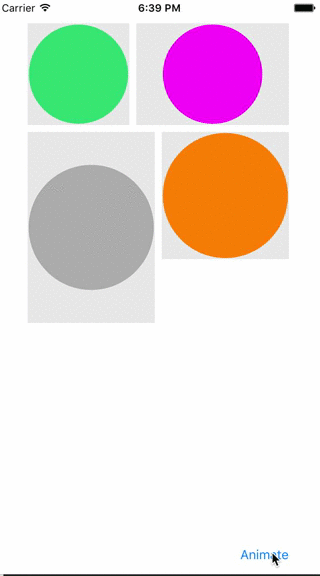

# DM3CheckmarkView
Basic checkmark animation

<p align="center">
  
</p>

## Installation
### CocoaPods
The recommended way for installating `DM3CheckmarkView` is via the [CocoaPods](http://cocoapods.org/) package manager
``` ruby
pod 'DM3CheckmarkView'
```

### Properties

Specify circle color:
``` objectivec
@property (nonatomic, strong) UIColor *circleColor;
```

Specify checkmark itself color:
``` objectivec
@property (nonatomic, strong) UIColor *checkmarkColor;
```

Specify animation duration:
``` objectivec
@property (nonatomic) double animationDuration;
```

Use the following method to trigger animation:
``` objectivec
- (void)animateCheckmark;
```

### ToDo List
- [ ] solve re-draw on rotation 
